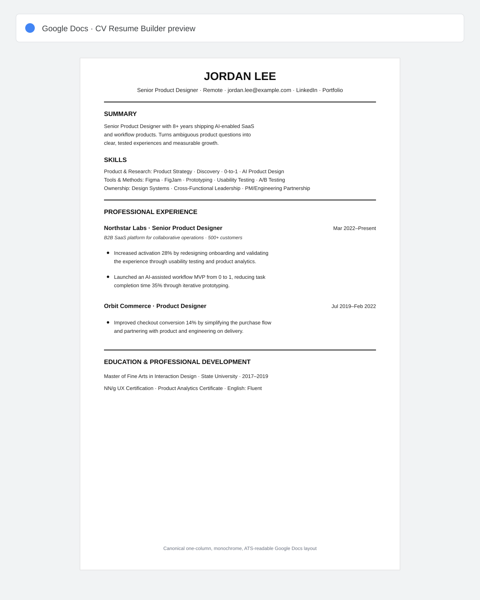

# CV Resume Builder

An evidence-based CV skill for Product Designers and adjacent product roles. It turns raw career information, an existing CV, or a LinkedIn profile into a concise, results-first CV prepared in the user's approved Google Docs format.



## How the skill works

The skill follows one controlled pipeline:

1. **Intake** — route the request as an existing-CV review, LinkedIn import, or one-question-at-a-time build from scratch.
2. **Evidence record** — capture role, dates, mission, actions, outcomes, metrics, attribution, tools, source, and confidentiality status.
3. **ATS and recruiter review** — identify parsing risks, keyword gaps, weak bullets, missing links, chronology issues, work-authorization ambiguity, and red flags before editing.
4. **Approval gate** — surface all numbers and uncertain claims for confirmation; do not silently invent or upgrade evidence.
5. **Google Docs delivery** — create or update the CV in the approved Google Docs document, preserving its current typography, spacing, section order, and one-column structure.
6. **Verification** — read the document back, check links and text order, and provide a concise change log plus remaining risks.

## What it is useful for

- Building a master CV for international Product Designer roles.
- Tailoring Summary, Skills, and experience bullets to a specific job description.
- Converting responsibilities into XYZ-style, results-first bullets.
- Making metrics precise without overstating personal attribution.
- Handling forecasts, team outcomes, and NDA-sensitive results safely.
- Diagnosing an uploaded PDF, DOCX, pasted CV, or Google Doc before changing it.
- Keeping a consistent, ATS-readable version for applications and a recruiter-friendly Google Docs source.

## What is included

- `SKILL.md` — the operating workflow and safety rules.
- `references/ats-and-role-tailoring.md` — ATS parsing and keyword tailoring guidance.
- `references/cv-quality-checklist.md` — final evidence, recruiter, and ATS gate.
- `references/evidence-and-metrics.md` — attribution, NDA, forecast, and work-authorization wording.
- `references/cv-templates.md` — the canonical current-template structure only; it does not provide alternate visual templates.
- `scripts/validate_resume.py` — lightweight checks for extracted CV text.
- `assets/cv-preview.svg` — a visual preview of the canonical Google Docs layout.

## How to use it in Codex

Install or copy this folder into your Codex skills directory, then write:

```text
Use $cv-resume-builder to create or tailor my ATS-ready CV in Google Docs.
```

For an existing CV:

```text
Use $cv-resume-builder to analyze this CV first. Return ATS risks,
recruiter red flags, evidence/metrics issues, and recommended changes.
Do not edit the document until I approve the changes.
```

For a new CV, the first intake question should clarify the target role, remote/employee/contract/freelance format, and any work-authorization constraint. The skill then asks one focused question at a time.

## How to use it in Claude

Connect the public GitHub repository to a Claude Project, add `SKILL.md` and the `references/` folder to Project Knowledge, and add this instruction:

```text
Use SKILL.md and its reference files as the rules for every CV task.
Use the canonical current CV template only. Analyze ATS and recruiter risks
before editing, preserve evidence attribution, and ask for approval before
changing an existing CV.
```

## Validation

```bash
python3 scripts/validate_resume.py path/to/extracted_resume.txt
```

The validator is a lightweight structural check. It does not replace evidence review, ATS inspection, or visual verification in Google Docs.
